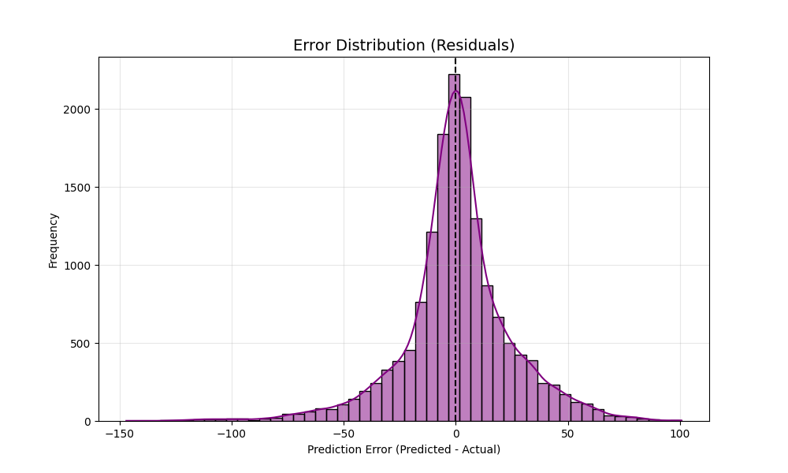

# DeepRUL: Temporal Attention Mechanisms for Turbofan Engine Prognostics


## 📌 Abstract

**DeepRUL** is a deep learning framework designed for **Prognostics and Health Management (PHM)** in industrial systems. Specifically, it targets the estimation of **Remaining Useful Life (RUL)** for turbofan engines using the NASA CMAPSS dataset.

Unlike traditional regression approaches, this architecture utilizes a **Long Short-Term Memory (LSTM)** network augmented with a **Soft Attention Mechanism**. This allows the model to dynamically weigh the importance of different time-steps in the sensor degradation sequence, helping it emphasize failure-relevant patterns while reducing sensitivity to noisy segments.

## 🚀 Key Features

- **Temporal Attention:** Learned context vectors to interpret sensor importance over time.
- **Robust Preprocessing:** Automated sliding-window sequence generation and min–max normalization.
- **Modular Architecture:** Decoupled training, evaluation, and data loading pipelines suitable for industrial deployment.
- **Reproducibility:** Configuration-driven experiments via YAML.

## 📊 Example Outputs

### 1) RUL Prediction vs Actual


### 2) Error Distribution (Residuals)


### 3) Sensitivity Across Degradation Regimes


## 📐 Mathematical Formulation

The core mechanism relies on computing a context vector based on the hidden states $h_t$ of the LSTM. The attention weights are computed via a softmax function:

$$
\alpha_t = \frac{\exp(e_t)}{\sum_{k=1}^{T} \exp(e_k)}
$$

The final context vector is a weighted sum of hidden states:

$$
c = \sum_{t=1}^{T} \alpha_t h_t
$$

Where $\alpha_t$ represents the attention weights determining the relevance of the sensor readings at time-step $t$ for the final RUL prediction.

> If your GitHub view does not render `$$ ... $$`, replace the equations with LaTeX-rendered image links or use a GitHub Pages site with MathJax.

## 📂 Dataset

This project utilizes the **NASA Commercial Modular Aero-Propulsion System Simulation (CMAPSS)** dataset.

> **Note:** Due to licensing and size constraints, the raw data is not included in this repository.

1. Download the dataset from: https://www.kaggle.com/datasets/behrad3d/nasa-cmaps
2. Extract the files.
3. Place `train_FD001.txt` and `test_FD001.txt` into the `data/raw/` directory.

## 🛠️ Installation

```bash
# Clone the repository
git clone https://github.com/raisandeepofficial/DeepRUL.git
cd DeepRUL

# Install dependencies
pip install -r requirements.txt
